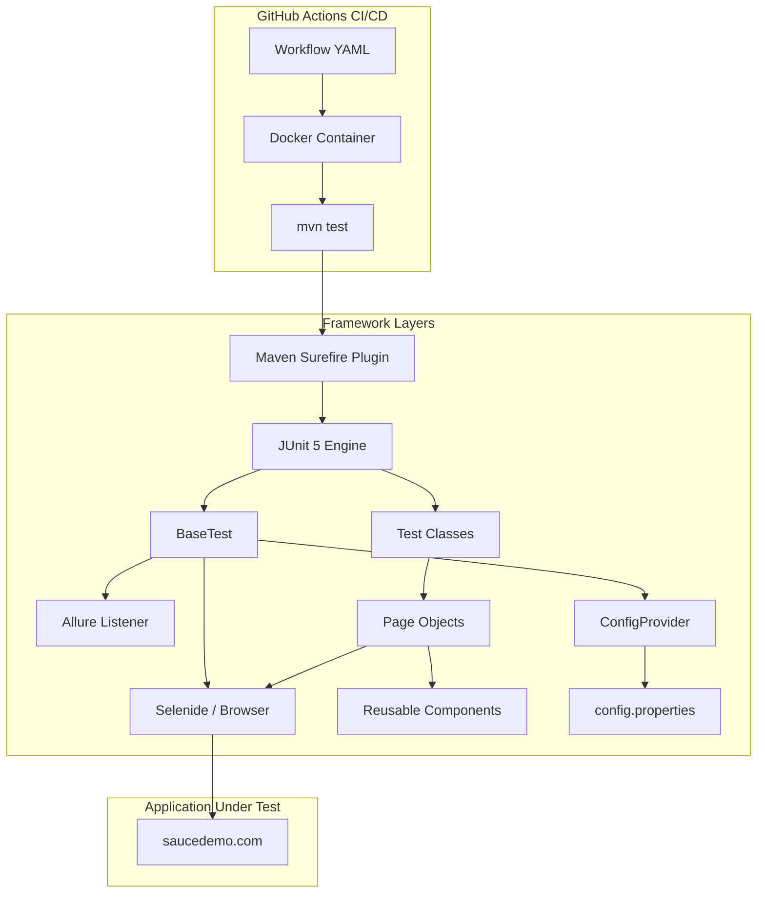
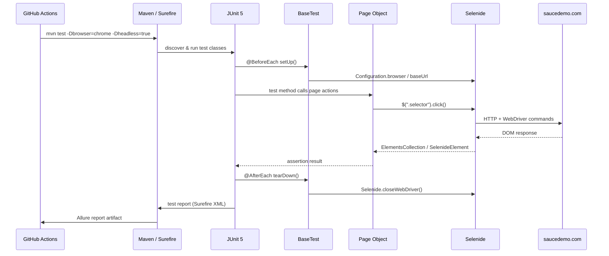

# Design Document: project-setup

## Overview

This document covers the technical design for bootstrapping a production-ready UI automation framework targeting [https://www.saucedemo.com](https://www.saucedemo.com). The stack is Java 17 + Selenide + JUnit 5 + Maven + Allure Reports + GitHub Actions + Docker, following clean architecture and the Page Object Model pattern.

The goal of Phase 1 is a fully configured, runnable Maven project with a dummy smoke test that proves the wiring is correct end-to-end before any real test logic is written.

---

## Architecture



---

## Sequence Diagrams

### Test Execution Flow



---

## Project Structure

```
ui-automation/
├── pom.xml
├── Dockerfile
├── .github/
│   └── workflows/
│       └── ci.yml
└── src/
    ├── main/
    │   ├── java/com/saucedemo/
    │   │   ├── config/          # ConfigProvider – reads config.properties
    │   │   ├── driver/          # (reserved) custom DriverFactory if needed
    │   │   ├── pages/           # Page Object classes
    │   │   └── utils/           # Shared utilities (waits, helpers)
    │   └── resources/
    │       └── config/
    │           └── config.properties
    └── test/
        ├── java/com/saucedemo/
        │   ├── base/            # BaseTest – JUnit 5 lifecycle + Selenide config
        │   └── smoke/           # SmokeTest – dummy test for Phase 1
        └── resources/
            └── allure.properties
```

---

## Components and Interfaces

### ConfigProvider

**Purpose**: Single source of truth for runtime configuration. Reads `config.properties` and exposes typed accessors. System properties override file values (enables CI overrides via `-D` flags).

**Interface**:
```java
public final class ConfigProvider {
    public static String getBaseUrl();
    public static String getBrowser();
    public static boolean isHeadless();
    public static long getTimeoutMs();
}
```

**Responsibilities**:
- Load `config/config.properties` from classpath on first access
- Allow system-property overrides (`-Dbase.url=...`)
- Provide sensible defaults so tests run locally without any flags

---

### BaseTest

**Purpose**: JUnit 5 abstract base class that every test class extends. Owns Selenide bootstrap and teardown.

**Interface**:
```java
@ExtendWith(AllureJunit5.class)
public abstract class BaseTest {
    @BeforeEach void setUp();
    @AfterEach  void tearDown();
}
```

**Responsibilities**:
- Apply `ConfigProvider` values to `com.codeborne.selenide.Configuration`
- Set `Configuration.browser`, `Configuration.baseUrl`, `Configuration.headless`, `Configuration.timeout`
- Call `Selenide.closeWebDriver()` after each test to avoid browser leaks
- Register Allure listener via `@ExtendWith(AllureJunit5.class)`

---

### Page Objects (base contract)

**Purpose**: Encapsulate all element locators and user-facing actions for a single page. Tests never reference raw Selenide selectors directly.

**Interface**:
```java
public abstract class BasePage<T extends BasePage<T>> {
    protected abstract T isLoaded();   // assert page is ready
}
```

**Responsibilities**:
- Declare `SelenideElement` / `ElementsCollection` fields with `@FindBy` or `$()` calls
- Expose fluent action methods that return `this` (or the next page) for chaining
- Never contain assertions — leave those to the test layer

---

### Reusable Components

**Purpose**: Sub-page fragments shared across multiple pages (e.g., navigation bar, shopping cart icon).

```java
public class NavBarComponent {
    private final SelenideElement cartBadge = $(".shopping_cart_badge");
    private final SelenideElement menuButton = $("#react-burger-menu-btn");

    public int getCartCount();
    public void openMenu();
}
```

---

## Data Models

### config.properties

```properties
base.url=https://www.saucedemo.com
browser=chrome
headless=true
timeout.ms=10000
```

### allure.properties

```properties
allure.results.directory=target/allure-results
```

---

## Key Functions with Formal Specifications

### ConfigProvider.getBaseUrl()

```java
public static String getBaseUrl()
```

**Preconditions:**
- `config.properties` exists on the classpath under `config/`
- `base.url` key is present OR `-Dbase.url` system property is set

**Postconditions:**
- Returns a non-null, non-empty URL string
- System property value takes precedence over file value

**Loop Invariants:** N/A

---

### BaseTest.setUp()

```java
@BeforeEach
public void setUp()
```

**Preconditions:**
- `ConfigProvider` is initialised and returns valid values
- A compatible browser binary (or remote WebDriver) is available

**Postconditions:**
- `Configuration.baseUrl` equals `ConfigProvider.getBaseUrl()`
- `Configuration.browser` equals `ConfigProvider.getBrowser()`
- `Configuration.headless` equals `ConfigProvider.isHeadless()`
- `Configuration.timeout` equals `ConfigProvider.getTimeoutMs()`
- No browser window is open yet (Selenide opens lazily on first `open()` call)

**Loop Invariants:** N/A

---

### BaseTest.tearDown()

```java
@AfterEach
public void tearDown()
```

**Preconditions:**
- Called after every test method regardless of pass/fail (JUnit 5 guarantee)

**Postconditions:**
- All browser windows opened during the test are closed
- WebDriver process is terminated
- No resource leaks between test methods

---

## Algorithmic Pseudocode

### Test Lifecycle Algorithm

```pascal
ALGORITHM runTest(testMethod)
INPUT: testMethod — a JUnit 5 test method
OUTPUT: TestResult (PASS | FAIL | ERROR)

BEGIN
  // Phase: setup
  config ← ConfigProvider.load()
  Configuration.baseUrl    ← config.baseUrl
  Configuration.browser    ← config.browser
  Configuration.headless   ← config.headless
  Configuration.timeout    ← config.timeoutMs

  // Phase: execute
  TRY
    testMethod.invoke()
    result ← PASS
  CATCH AssertionError e
    result ← FAIL(e)
  CATCH Exception e
    result ← ERROR(e)
  END TRY

  // Phase: teardown (always runs)
  Selenide.closeWebDriver()

  RETURN result
END
```

**Preconditions:** Browser binary available; config values valid  
**Postconditions:** Browser closed; result recorded by JUnit/Allure  
**Loop Invariants:** N/A

---

### ConfigProvider Load Algorithm

```pascal
ALGORITHM loadConfig()
INPUT: classpath resource "config/config.properties"
OUTPUT: Properties map

BEGIN
  props ← new Properties()
  stream ← ClassLoader.getResourceAsStream("config/config.properties")

  IF stream IS NULL THEN
    THROW IllegalStateException("config.properties not found")
  END IF

  props.load(stream)

  // System properties override file values
  FOR each key IN props.keySet() DO
    sysVal ← System.getProperty(key)
    IF sysVal IS NOT NULL THEN
      props.set(key, sysVal)
    END IF
  END FOR

  RETURN props
END
```

**Preconditions:** `config.properties` on classpath  
**Postconditions:** All keys resolved; system props take precedence  
**Loop Invariants:** All previously processed keys retain their resolved value

---

## Correctness Properties

```java
// 1. ConfigProvider always returns a non-null base URL
assert ConfigProvider.getBaseUrl() != null && !ConfigProvider.getBaseUrl().isBlank();

// 2. System property overrides file value
System.setProperty("base.url", "https://override.example.com");
assert ConfigProvider.getBaseUrl().equals("https://override.example.com");

// 3. After tearDown, no active WebDriver sessions remain
// (verified by checking WebDriverRunner.hasWebDriverStarted() == false)

// 4. Every Page Object's isLoaded() must pass before actions are called
// (enforced by BasePage contract — tests call page.isLoaded() on navigation)

// 5. Dummy smoke test opens base URL and receives HTTP 200
// (Selenide.open() throws if page fails to load within timeout)
```

---

## Error Handling

### Browser Not Found

**Condition**: `Configuration.browser` value has no matching WebDriver binary  
**Response**: Selenide throws `WebDriverException` on first `open()` call  
**Recovery**: CI uses Docker image with pre-installed Chrome; local devs run `webdrivermanager` auto-resolution (included via Selenide's built-in manager)

### Config File Missing

**Condition**: `config/config.properties` absent from classpath  
**Response**: `ConfigProvider` throws `IllegalStateException` with a descriptive message  
**Recovery**: File is committed to `src/main/resources/config/` — missing only if build is broken

### Test Timeout

**Condition**: Selenide element wait exceeds `Configuration.timeout`  
**Response**: `ElementNotFound` exception with full selector path  
**Recovery**: Increase `timeout.ms` in config or fix the selector; Allure captures screenshot automatically via `AllureSelenide` listener

### CI Docker Failure

**Condition**: Docker image pull fails or Chrome crashes inside container  
**Response**: GitHub Actions step exits non-zero; workflow marked failed  
**Recovery**: Pin Docker image tag; use `--no-sandbox --disable-dev-shm-usage` Chrome flags (set in `BaseTest`)

---

## Testing Strategy

### Unit Testing Approach

`ConfigProvider` logic (property loading, override precedence) is tested with plain JUnit 5 — no browser required. Target: 100% branch coverage on config resolution.

### Property-Based Testing Approach

Not applicable for Phase 1 (infrastructure setup). Will be introduced in later phases for data-driven scenarios.

**Property Test Library**: fast-check (if JS layer added) or jqwik (Java) in future phases.

### Integration / E2E Testing Approach

The dummy smoke test in `SmokeTest.java` acts as the integration gate:
- Opens `https://www.saucedemo.com`
- Asserts the page title contains "Swag Labs"
- Passes only if Selenide, browser, and network are all wired correctly

All subsequent feature phases add test classes that extend `BaseTest` and follow the same pattern.

---

## Performance Considerations

- `Configuration.headless = true` in CI eliminates GPU overhead and reduces memory usage per test
- Selenide's built-in smart waits replace `Thread.sleep()` — no artificial delays
- Surefire `forkCount=1` for Phase 1; parallel execution (`forkCount=2C`) deferred to a later phase once thread-safety of page objects is verified
- Docker layer caching on `pom.xml` ensures Maven dependencies are not re-downloaded on every CI run

---

## Security Considerations

- Credentials for saucedemo.com are stored as GitHub Actions secrets (`SAUCE_USERNAME`, `SAUCE_PASSWORD`), never hardcoded
- `config.properties` contains only non-sensitive defaults; sensitive values injected via `-D` system properties at runtime
- Docker image is pinned to a specific digest to prevent supply-chain attacks
- No production data is used; saucedemo.com is a public demo site

---

## Dependencies

| Dependency | Version | Purpose |
|---|---|---|
| Java | 17 | Language runtime |
| Selenide | 7.x | Browser automation (wraps Selenium 4) |
| JUnit 5 (Jupiter) | 5.10.x | Test framework |
| Allure JUnit5 | 2.x | Test reporting |
| Allure Selenide | 2.x | Auto-screenshot on failure |
| Maven Surefire Plugin | 3.x | Test runner / XML reports |
| Maven Compiler Plugin | 3.x | Java 17 source/target |
| Docker (selenium/standalone-chrome) | latest-stable | Headless Chrome in CI |
| GitHub Actions | — | CI/CD pipeline |
